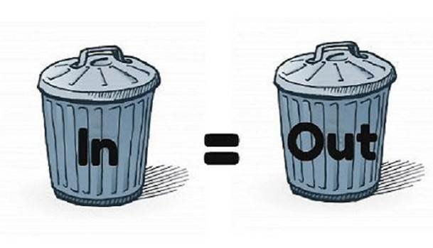

---
title: "資料整合與資料工程"
author: "Wush Wu"
date: "June 01, 2017"
output:
  ioslides_presentation:
    css: 
      - css/dsp.css
      - css/2017-06-07.css
    self_contained: no
    widescreen: yes
--- 

```{r setup, include=FALSE}
knitr::opts_chunk$set(echo = TRUE)
set_notes <- function(s) {
  sprintf('<div class="notes">%s</div>', s)
}
set_image <- function(name, style = "height:400px;") {
  sprintf('</img>', name, style)
}
```

# 資料科學的Hello World

## Dashboard的製作就是資料科學團隊的Hello World

<center>
</img>
</center>

## 檢驗資料的品質

<center>
</img>
</center>

<div class="notes">
Source: https://www.linkedin.com/pulse/supply-chain-planning-garbage-out-cheryl-wiebe
</div>

## 檢驗科學家們對資料的理解

<center>
</img>
</center>

<div class="notes">Source: https://www.slideshare.net/carlotorniai/data-science-for-smart-manufacturing</div>

## 每導入一個資料源，就應該要製作對應的Dashboard

### 上游污染、下游受害

<center>
`r set_image("article-2646549-1E6B5BE200000578-780_964x705.jpg")`
</center>

`r set_notes("http://www.dailymail.co.uk/indiahome/indianews/article-2646549/Ganga-clean-Himalayan-task-The-challenges-facing-Modis-mission-improve-Indias-polluted-river.html")`

## Dashboard能為資料科學團隊建立初步的信譽

<center>
</img>
</center>

`r set_notes("Source: http://community.uservoice.com/blog/you-cant-have-trust-without-transparency/")`

## R 語言的解決方案 {.center}

- shiny
- flexdashboard
- Rmarkdown
- Batch Job

### 等實作時間再跟同學介紹

# 資料分析的目的是價值

## 資料部門在企業中是成本單位

<center>
`r set_image("cost-accounting-40.jpg")`
</center>

`r set_notes("http://www.referenceforbusiness.com/encyclopedia/Con-Cos/Cost-Accounting.html")`

## 老闆對資料團隊的期待...?

<center>
`r set_image("toug-big-data-challenge-and-impact-2-638.jpg")`
</center>

`r set_notes("https://www.slideshare.net/Toronto-Oracle-Users-Group/toug-big-data-challenge-and-impact-v1")`

## 有時老闆已經知道團隊的任務 {.smaller .columns-2 .centered}
</img>
<h3>金融投資、避險</h3>
取自 <https://goo.gl/4USt8w>

</img>
<h3>廣告推薦引擎</h3>
取自 <https://goo.gl/FAe9V9>

## 有時資料科學家要自己發想問題{.smaller .columns-2 .centered}
</img>
<h3>Google用Machine Learning省電</h3>
取自 <https://goo.gl/vOc0h4>

</img>
<h3>貨運公司UPS發現不左轉比較省油</h3>
取自 <https://goo.gl/hwWvzZ>

## 但是老闆不願意只看到......{.smaller .centered}
</img>
<h3>方法的「創新」不重要，重要的是對公司帶來的影響</h3>
取自 <https://goo.gl/1eiyeM>

## 問題：對一個資料科學團隊，怎麼產生價值？

# 資料整合是新價值的捷徑

## 數據分析是個悠久的知識產業

- 玉山銀行的CRM部門已經十年......
- 工廠用資料做品管提升已經數十年......

## 單一資料可能已經被分析得透徹...

- 分析獲得的知識，要「新」才有意義

## 大數據時的不同

<center>
`r set_image("big-data-ppt-6-638.jpg")`
</center>

`r set_notes("https://www.slideshare.net/nasrinhussain1/big-data-ppt-31616290")`

## {.Selection_096}

## 資料整合變成產生價值的捷徑{.smaller .centered}

</img>
<h3>風速資料與機場起降資料整合 ==> 檢驗兩者的關係</h3>

`r set_notes("圖片取自 <https://goo.gl/do4Ew2>")`

## 資料整合變成產生價值的捷徑{.smaller .centered}

</img>
<h3>房貸餘額與GDP的比較 ==> 房地產泡沫化指數</h3>

`r set_notes("圖片取自 <https://goo.gl/tH0RWw>")`

## 資料整合變成產生價值的捷徑{.smaller .centered}

<iframe style="width: 560px; height: 315px;" src="https://www.youtube.com/embed/WM2HtSFlnhI?rel=0" frameborder="0" allowfullscreen></iframe>
<h3>台灣出入境人數 v.s. 旅遊業GDP</h3>

## 資料整合變成產生價值的捷徑{.smaller .centered}

</img>
<h3>資策會資安所把不同廠商的資安紀錄整合</h3>
<h3>==> 可以觀察與追蹤跨區駭客的足跡</h3>
<h3>故事來源：[MLDM Monday | Cyber Security](https://www.meetup.com/Taiwan-R/events/221493175/)</h3>

`r set_notes("圖片取自 <https://goo.gl/5L6DWH>")`

# 資料整合的目的

## 更多的Covariates、Features、相關性...

- 風速資料與機場起降資料整合 ==> 檢驗兩者的關係
- 台灣出入境人數 v.s. 旅遊業GDP ==> 檢驗兩者的關係
- 資策會資安所整合資安紀錄 ==> 更完整駭客足跡

## 參考標準

- 房貸餘額與GDP的比較 ==> 房地產泡沫化指數
- 薪資成長與GDP的比較 ==> 經濟成長分配問題
- 業務成長與市場成長 ==> 了解公司在市場的消長

# 一般資料的整合

## {.data_join}

## {.merge-by-time}

## 時間資料整合 {.smaller .centered}

</img>
<h3>相同欄位對應的意義不一定一樣</h3>

`r set_notes("取自 <https://goo.gl/LX06rE>")`

## {.merge-by-spatial}

## 空間資料整合

### 空間資料的形式

- Grid
- Location
- Shape

## 空間資料的形式  {.smaller .centered}

### Grid

`r set_image("image007.gif")`

`r set_notes("http://www.innovativegis.com/basis/BeyondMappingSeries/BeyondMapping_IV/Topic9/BM_IV_T9.htm")`

## 空間資料的形式  {.smaller .centered}

### Location

`r set_image("location.png")`

`r set_notes("Google Map")`

## 空間資料的形式  {.smaller .centered}

### Shape

`r set_image("taiwan_work_large.gif")`

`r set_notes("http://volcano.gl.ntu.edu.tw/worldwide/taiwan_workmap.htm")`

## R 語言的解決方案

- dplyr 各種join
- 設計並建立「比對的`key`」
- 控制時間的表現方式：時間(POSIXct) ==> 字串(character)
- 空間相關套件

### 等實作時間再跟同學介紹

# 具分析思維的資料處理

## 資料處理的要點

- 資料「科學」：如何讓其他人重現分析結果？
- 資料品質：如何在處理資料時能確保資料品質？
- 資料的一致性

# 可重現的分析

## 影響分析結果的要素 {.columns-2}

- 資料
- 演算法
    - 隨機亂數

`r set_image("ReproducibleAnalysis.png")`

## 如何建構可重現的分析 {.columns-2}

- 建立資料的archive
- 將演算法的實作納入程式碼的版本控制
    - 使用可設定seed的random number generator
    - 紀錄initial point

`r set_image("Octocat.png")`

## 範例

<https://github.com/wush978/KDD2015wpp>

- 資料：[iPinYou Real-Time Bidding Dataset for Computational Advertising Research](http://data.computational-advertising.org/)
- 演算法：github
    - 作業系統套件與R語言套件：docker
    - 隨機亂數：從0開始

# 資料品質

## 永遠都不修改既有的資料 

- 我們會犯錯
- 不會限縮分析的範圍

`r set_image("disaster.jpeg")`

## 分析上  {.columns-2}

- 獲取資料比分析資料貴
- 錯誤的更動原始資料 ==> 重新收集資料
- 事後追錯，可重現分析的情境
    - 重現非常非常的重要，尤其是當你找到驚人的大發現

`r set_image("twyman.jpeg")`

## 範例：社交服務的資料設計

### 情境：

1. 使用者A跟隨了使用者B
2. 使用者A取消跟隨了使用者B

### 作法

1. 更新既有的資料
    - 使用者B的「跟隨者」清單中，新增使用者A
    - 使用者B的「跟隨者」清單中，移除使用者A
2. 不更動既有的資料
    - 紀錄使用者A跟隨使用者B的事件
    - 紀錄使用者A取消跟隨使用者B的事件

## 範例：比較兩種做法的後果

|問題|方法1|方法2|
|-|-|-|
|列出跟隨B的使用者|讀取使用者B的「跟隨者」清單|從事件中找出目前正在跟隨B的使用者|
|計算有多少人跟隨B|計算使用者B的「跟隨者」清單的長度|從事件中計算目前正在跟隨B的使用者|
|列出兩年前跟隨B的使用者|...|從事件中找出兩年前正在跟隨B的使用者|

<br/>
<br/>

- 更動資料，會讓我們無法追歷史

## 資料的一致性 {.centered}

`r set_image("eventual-consistency.png")`

`r set_notes("http://cloudshankar.blogspot.tw/2013/05/eventual-consistency.html")`

## 資料的一致性 {.centered}

### 為了效能，業務用的資料源與分析用不同

`r set_image("SocialMedia.png")`

## 解決方法

- 同時記錄NoSQL Database的State
    - 分析時會一併考慮NoSQL Database的誤差

## 資料的一致性 {.centered}

### 為了效能，分析的資料源是Column Oriented Database

`r set_image("column-oriented-database.jpg")`

`r set_notes("Source: https://www.dbbest.com/blog/column-oriented-database-technologies/")`

## 解決方法

### 釐清分析的目的

- EDA、找問題、找想法用Column Oriented Database
    - 快、Iterative
- 建立服務用的模型、資料產品，用Raw Log當Input

# 共享資料ETL的功能

## [Using R Packages and education to scale Data Science at Airbnb](https://medium.com/airbnb-engineering/using-r-packages-and-education-to-scale-data-science-at-airbnb-906faa58e12d) {.centered}

`r set_image("1*BTMbVFh_hziJJcaQ7TBRwg.png")`

`r set_notes("Source: https://medium.com/airbnb-engineering/using-r-packages-and-education-to-scale-data-science-at-airbnb-906faa58e12d")`

## 共享ETL帶來的好處

- 資料格式的一致
    - 資料的一致
- 程式碼的一致
    - 環境的一致、演算法的一致

## 使用R語言建構可擴充的資料科學工作環境 {.columns-2}

- 可重現的分析工作
- 工具鍊、文件
- 新演算法的推廣

`r set_image("Fig46_scale_out.png")`

`r set_notes("Source: https://www.scaleoutsoftware.com/technology/reports-of-scale-outs-demise-are-greatly-exaggerated/")`

# 實作區 - 快速建構 Dashboard

## [knitr](https://yihui.name/knitr/) {.columns-2}

- `.Rmd`，已經整合至Rstudio
- 文件與程式碼的整合
- 動態產生文件

`r set_image("knitr-rmarkdown.png")`

`r set_notes("Source: https://www.slideshare.net/sahirbhatnagar/an-introduction-to-knitr-and-r-markdown")`

## 活用RMarkdown來呈現分析結果

- 文字結構：`#`、`##`、`###`、....
- 程式碼：\`x <- ...\` ==> `x <- ...`
- 畫圖：

```txt
  \```{r chunk-title, chunk-options}
  \```
```

- `knit`...

## knitr tricks

- setup chunk: 幫每個文件客製化knitr default options
    - 每日報表->取消cache
    - 研究為主->開啟cache
    - `r set_image("setup-chunk.png", "width: 400px;")`
- 學術研究相關格式
    - biblography: `@xxx` 搭配 .bib 的key: `xxx {...}`
    - `$...$` inline math formula, `$$...$$` outline math formula
        - $x_i \sim N(\mu, \sigma^2)$
- Build --> Configure Build --> Makefile...(Ctrl+B 自動編譯)

## Web Based Presentation {.columns-2}

- Shiny ==> 互動網站
- knitr ==> rmarkdown ==> 靜態報表
- 透過[htmlwidget](https://cran.r-project.org/package=htmlwidgets)技術發布的套件，可以同時用於Shiny與rmarkdown

`r set_image("rmarkdown.png")`

## [flexdashboard](http://rmarkdown.rstudio.com/flexdashboard/)

- 適合用於製作dashboard

`r set_image("flexdashboard.png")`

`r set_notes("Source: https://beta.rstudioconnect.com/jjallaire/htmlwidgets-ggplotly-geoms/htmlwidgets-ggplotly-geoms.html")`

## 範例：[Power Analysis for DSP](https://github.com/unityculture/Power_EDA)

- <a href="Power_EDA/Power_EDA.html" target="_blank">Demo</a>
- <a href="https://github.com/unityculture/Power_EDA/blob/master/Power_EDA.Rmd" target="_blank">Source</a>

`r set_image("Power_EDA-demo.png")`

## 每日定時執行R

- Windows: [taskscheduleR](https://github.com/bnosac/taskscheduleR)
- Linux/Unix: [cronR](https://github.com/bnosac/cronR)
- Jenkins/Crontab/Task Scheduler + Rscript + command line options(ex: [optparse](https://github.com/trevorld/optparse))

`r set_image("optparse.gif", "width:100%;")`

# Data Join

## 操作時間

- 請完成 02-RDataEngineer-05-Data-Manipulation
- 請完成 02-RDataEngineer-06-Join

## 時間資料整合的討論

- 累積數據(GDP) v.s. 瞬間數據(房貸餘額)
    - 2010年的GDP v.s. 2010-01的房貸餘額，合理嗎？

## 空間資料整合的範例

- Location <--> Shape
    - `sp::over` ex: <a href="https://rpubs.com/ckghosted/207023" target="_blank">Simple EDA for Solar Farmland Analysis Part 2</a>
- Location <--> Grid
    - `sp::over`
    - [Kriging](https://en.wikipedia.org/wiki/Kriging)
- Grid <--> Shape
    - `sp::over`
    - Reduce Grid to Location

## Q&A
