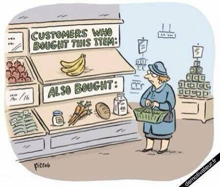
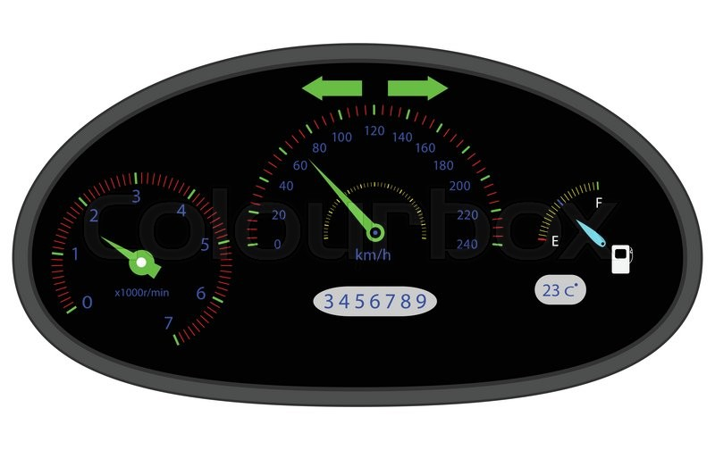

---
title: "Outline"
author: "Wush Wu"
date: "June 01, 2017"
output:
  ioslides_presentation:
    css: css/dsp.css
    self_contained: no
    widescreen: yes
--- 

```{r setup, include=FALSE}
knitr::opts_chunk$set(echo = TRUE)
```


# 資料分析的目的是價值

## 資料部門在企業中是成本單位

## 老闆期待資料部門能找到關鍵知識

## 有時解決的問題本身即與金錢有關 {.smaller .columns-2 .centered}
</img>
<h3>金融投資、避險</h3>
取自 <https://goo.gl/4USt8w>

</img>
<h3>廣告推薦引擎</h3>
取自 <https://goo.gl/FAe9V9>

## 有時資料科學家要自己發想問題{.smaller .columns-2 .centered}
</img>
<h3>Google用Machine Learning省電</h3>
取自 <https://goo.gl/vOc0h4>

</img>
<h3>貨運公司UPS發現不左轉比較省油</h3>
取自 <https://goo.gl/hwWvzZ>

## 但是老闆不願意只看到......{.smaller .centered}
</img>
<h3>方法的「創新」不重要，重要的是對公司帶來的影響</h3>
取自 <https://goo.gl/1eiyeM>

## 問題：對一個資料科學團隊，怎麼產生價值？

# 資料整合是資料科學的捷徑

## 數據分析是個悠久的知識產業

(例：玉山銀行的CRM部門已經十年......)

(例：工廠用資料做品管提升已經數十年...... 關鍵字：田口方法)

## 單一資料可能已經被分析得透徹...

分析獲得的知識，要「新」才有意義

## 大數據時代帶來的優勢

資料來源變得更廣泛

## 開放資料帶來的優勢

政府的資料釋出了

## 資料整合變成產生價值的捷徑{.smaller .centered}
</img>
<h3>資策會資安所把不同廠商的資安紀錄整合</h3>
<h3>==> 可以觀察與追蹤跨區駭客的足跡</h3>
取自 <https://goo.gl/5L6DWH>

## 資料整合變成產生價值的捷徑{.smaller .centered}
</img>
<h3>風速資料與機場起降資料整合 ==> 發現兩者的關係</h3>
取自 <https://goo.gl/do4Ew2>

## 資料整合變成產生價值的捷徑{.smaller .centered}
</img>
<h3>房貸餘額與GDP的整合 ==> 房地產泡沫化指數</h3>
取自 <https://goo.gl/tH0RWw>

# 資料整合的方式

## SQL 上的資料整合

請參考 https://en.wikipedia.org/wiki/Join_(SQL) 上的說明幫我做個1~2頁的介紹，如果不行就留白我之後自己補上

## 常見時間資料整合的問題：{.smaller .centered}
</img>
<h3>相同欄位對應的意義不一定一樣</h3>
取自 <https://goo.gl/LX06rE>

## 解決辦法

找出合理的比對時間點

## 常見的空間資料整合問題

# 實務上的注意事項

## 對資料的操作可以CREATE、READ但不要UPDATE、DELETE

Immutable 對資料品質非常重要

## Immutable Data

處理資料時犯錯後，只能回溯沒有被Update/Delete的部分

## 假刪除

添增欄位：IsDelete

## 用版本取代Update/Delete

添增欄位：Version、mtime等等

## Hadoop時代......

每次Transform告一段落後就寫入snapshot

每次清理後資料都會變小：PB-->TB-->GB-->MB...
